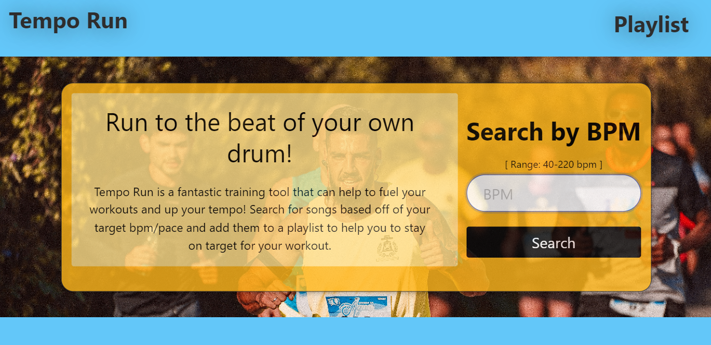
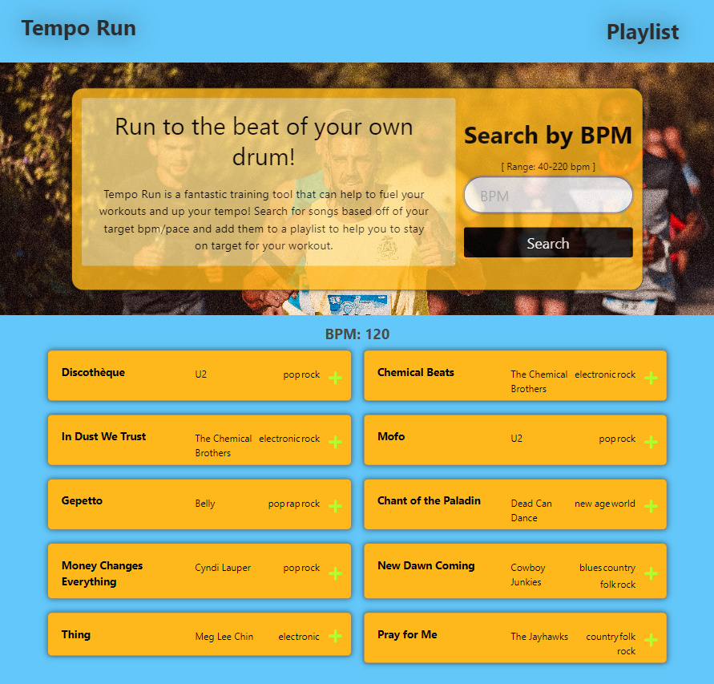
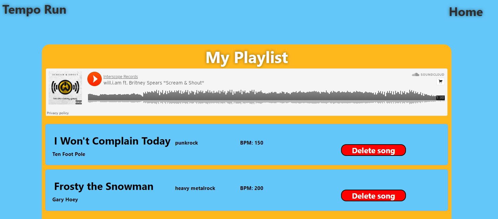

# TempoRun Song Finder Application

## Description

As a runner training for a marathon, I want to be able to set my pace as I train, with a song playlist. Our team decided to create an application that allows the user to search for a specified BPM (beats per minute), and save songs from the search results to a playlist.

We were able to leverage as well as build upon the skills we have learned so far. A few examples are:
- Planning and delegating tasks for application development
- Creating a smooth and interactive user experience
- Learning how to use new third-party APIs
- Managing GitHub branches with commits and pull request made by more than one user

## Installation

N/A

## Technologies

This project is created with the following:

- Bulma version 0.9.4
- JQuery version 3.4.1
- Font Awesome version 5.11.2
- SweetAlert version 1

## Usage

Link to deployed application can be found [here](https://amaragh.github.io/tempo-run-songfinder/).

This application allows the user to search for songs by beats per minute (BPM). The allowed BPM range is 40-220 and the input element will validate against any value entered in this field. When the user submits the search, information for 10 songs is displayed below the hero element. The user can then add a song to their playlist by clicking the plus icon. To access the playlist, click on the Playlist link in the nav bar. 

The user can also navigate back to the homepage from the playlist by clicking the "Home" button.

Please see below for some screenshots of the application.

Below is the homepage before the BPM search is executed.

Below is the homepage after searching for a sample BPM of 120.

Below is the Playlist page with a couple of sample songs added. The SoundCloud music player appears at the top of the playlist.

## Credits

This project was completed by the following collaborators and their contributions are also noted below:

|Collaborators                                       |Roles and Contributions|
|---                                                 |---                    |
|[Camden Barnard](https://github.com/chikn4theWIN)   | Playlist HTML, CSS and Bulma CSS; JS to save playlist to localStorage; JS to delete songs from playlist and localStorage
|
|[Fidel Deaquino](https://github.com/fdeaquino)      |Homepage HTML; overall CSS and Bulma styling; overall homepage/hero/form web responsiveness; input range element; media queries|
|[Patrick Duffy](https://github.com/Patrick-Duffy202)| Initial Homepage HTML framework; overall CSS and Bulma styling; overall homepage/hero/form web responsiveness; SweetAlert modal; footer content and style|
|[Alecia Maragh](https://github.com/amaragh)         |Team Lead; GetSongbpm API call; search result display, style and mobile responsiveness; SweetAlert modal; footer content and style; media queries; playlist iframe|

The [GetSongBPM API](https://getsongbpm.com/) was used to retrieve the list of songs returned by the search on the homepage.

The [SoundCloud Widget API](https://developers.soundcloud.com/docs/api/html5-widget) was used to create the music player iframe on the playlist page.

## License

Please see repo for license information